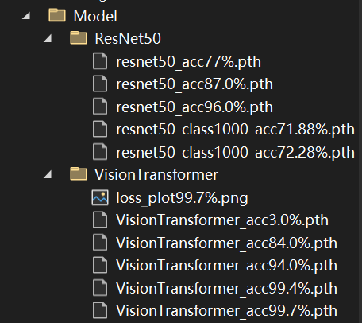

# 1.本仓库做了什么
## 1.1 实现了Vision Transformer(Vit)的本地部署和训练
在[ViT_Train.py](.\ViT_Train.py)文件中对预训练模型（[vit_base_patch16_224](https://zhuanlan.zhihu.com/p/713616890)）进行了微调，微调前模型是基于ImageNet2012训练的，输出为1000类，我们将其改为58类（基于国内交通标志数据集）。
```
pretrained_model.head = nn.Linear(pretrained_model.head.in_features, classes)
```
训练过程中，我们使用了交通标志数据集，数据集中包含58类交通标志，每类交通标志有1000张图片，训练集和验证集的划分比例为0.8:0.2，训练集和验证集的数据增强方法为：
```
# 数据增强方法
train_transform = transforms.Compose([
	# 将图片resize到224*224以适应Vit模型的输入
	transforms.Resize((224, 224)),
	# 随机水平翻转以增加数据多样性
	transforms.RandomHorizontalFlip(),
	# 随机垂直翻转以增加数据多样性
	transforms.RandomVerticalFlip(),
	# 随机旋转15度以增加数据多样性
	transforms.RandomRotation(15),
	# 将图片转换为tensor
	transforms.ToTensor(),
	# 标准化
	transforms.Normalize(mean=[0.485, 0.456, 0.406], std=[0.229, 0.224, 0.225])
])
```


## 1.2 实现了对ViT模型的攻击
在Attack.py文件中实现了对Vit模型的攻击，攻击方法为FGSM，攻击目标为交通标志数据集中的部分图片，攻击成功率为100%(补丁大小为10%时)。
```
def fgsm_attack(image, epsilon, data_grad):
	# 找到数据梯度的方向
	sign_data_grad = data_grad.sign()
	# 生成对抗样本
	perturbed_image = image + epsilon*sign_data_grad
	# 限制对抗样本的像素值在[0,1]之间，因为原始图片的像素值在[0,1]之间
	perturbed_image = torch.clamp(perturbed_image, 0, 1)
	# 返回对抗样本
	return perturbed_image
```
## 1.3 实现了ResNet50模型的本地部署和训练
在[ResNet_Train.py](.\ResNet_Train.py)文件中对预训练模型（[resnet18](https://pytorch.org/hub/pytorch_vision_resnet/)）进行了微调，微调前模型是基于ImageNet2012训练的，输出为1000类，我们将其改为58类（基于国内交通标志数据集）。
```
model = models.resnet18(pretrained=True)
pretrained_model.fc = nn.Linear(pretrained_model.fc.in_features, classes)
```
## 1.4 实现了对ResNet50模型的攻击
在Attack.py文件中实现了对ResNet50模型的攻击，攻击方法为FGSM，攻击目标仍为交通标志数据集中的部分图片。

# 2.本地运行所需环境
## 2.1 本地python环境
本地python环境为Python 3.9.13,环境版本及具体包在[environment.txt](.\environment.txt)中。
## 2.2 本地运行所需环境
通过以下pip命令安装快速所需环境：
```
pip install -r environment.txt
```
亦可通过以下conda命令创建所需环境：
```
conda create -n myenv python=3.9
conda activate myenv
pip install -r environment.txt
```
## 2.3 数据库来源
[Chinese Traffic Sign Database](https://www.nlpr.ia.ac.cn/pal/trafficdata/detection.html)
# 3.本地运行方法
## 3.1运行attack.py即可运行攻击模型
```python
python attack.py
```

## 3.2运行ViT_Train.py即可运行训练模型
```python
python ViT_Train.py
```

## 3.3运行ResNet_Train.py即可运行训练模型
```python
python ResNet_Train.py
```


# 4.训练及攻击结果的保存
## 4.1训练结果的保存
训练结果的保存在[VisionTransformer](./Model/VisionTransformer)和[ResNet50](./Model/ResNet50)中。


## 4.2攻击结果的保存
攻击结果的保存在[Attack](.\result)中。


# 5.数据集的预处理（附录）
见我的个人[blog](https://blog.csdn.net/m0_59085764/article/details/127266647?spm=1001.2014.3001.5502)
# 注意
github限制过大文件的上传，如果需要以下文件，请联系我
[QQ](https://qm.qq.com/q/fUZH3NVcf6)[163邮箱](liu128786292@163.com)


